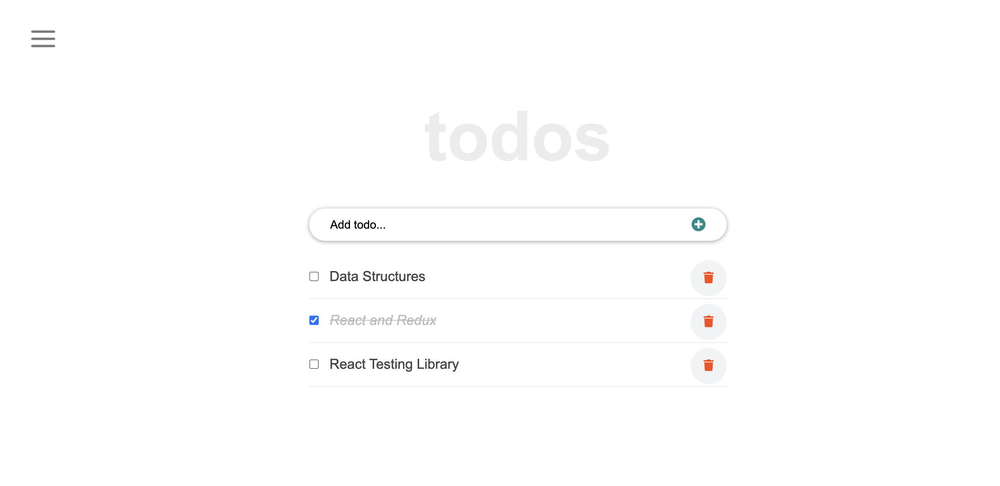

# REACT TODO TUTORIAL

## Built With

- JavaScript
- React
- HTML, CSS, JSX, WebPack, Git, GitHub

## Steps to run the project in your local machine

Go To Terminal and paste the following command:

`git clone git@github.com:zainsadaqat/react-todo-tutorial.git`

`cd react-todo-tutorial`

`npm install`

`npm start`

## Author

👤 **Zain Sadaqat**

- GitHub: [ZainSadaqat](https://github.com/zainsadaqat)
- Twitter: [ZainSadaqat](https://twitter.com/zain_sadaqat)
- LinkedIn: [ZainSadaqat](https://linkedin.com/in/zain-sadaqat)

## 🤝 Contributing

Contributions, issues, and feature requests are welcome!

Feel free to check the [issues page](../../issues/).

## Show your support

Give a ⭐️ if you like this project!

## Acknowledgments

- https://github.com/Ibaslogic/react-todo-project

## 📝 License

This project is [MIT](./MIT.md) licensed.
